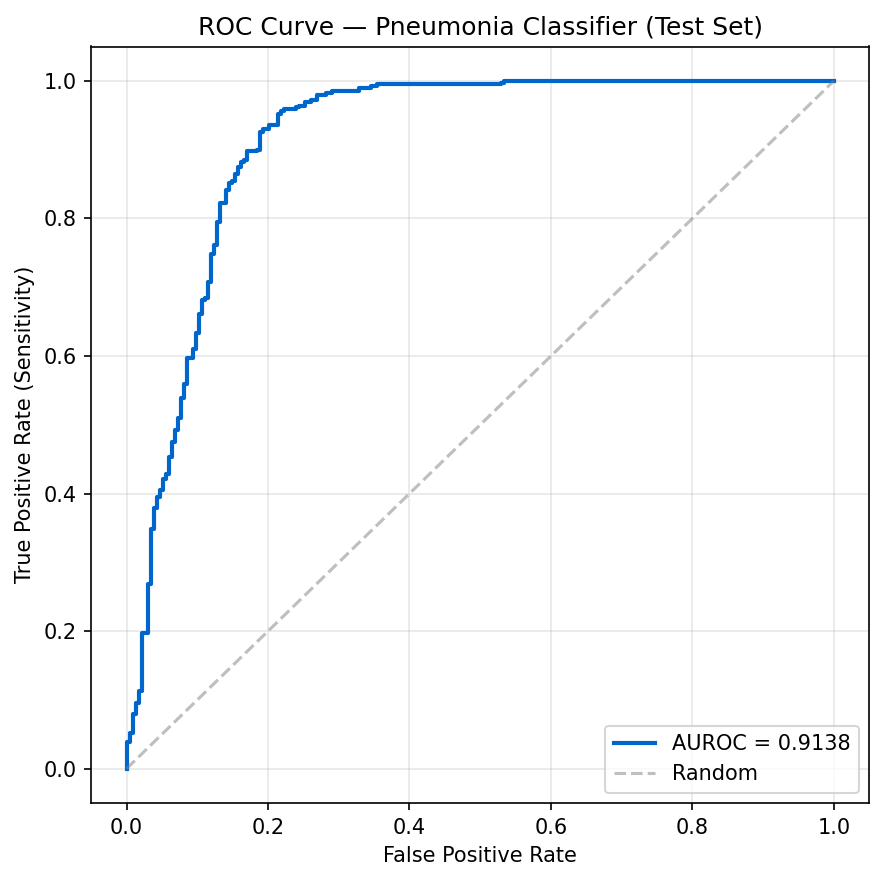
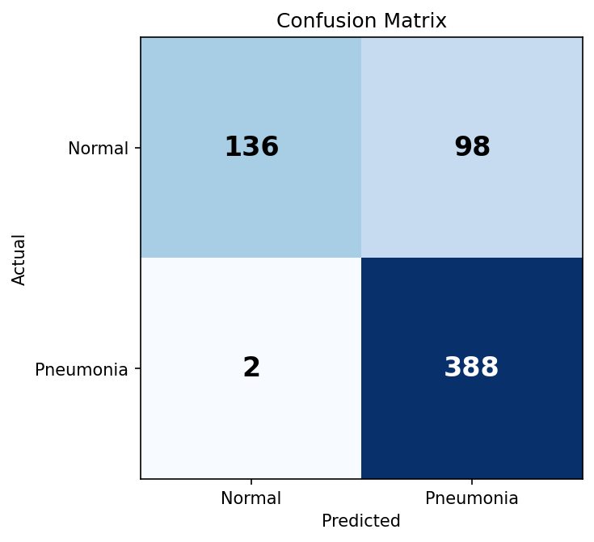
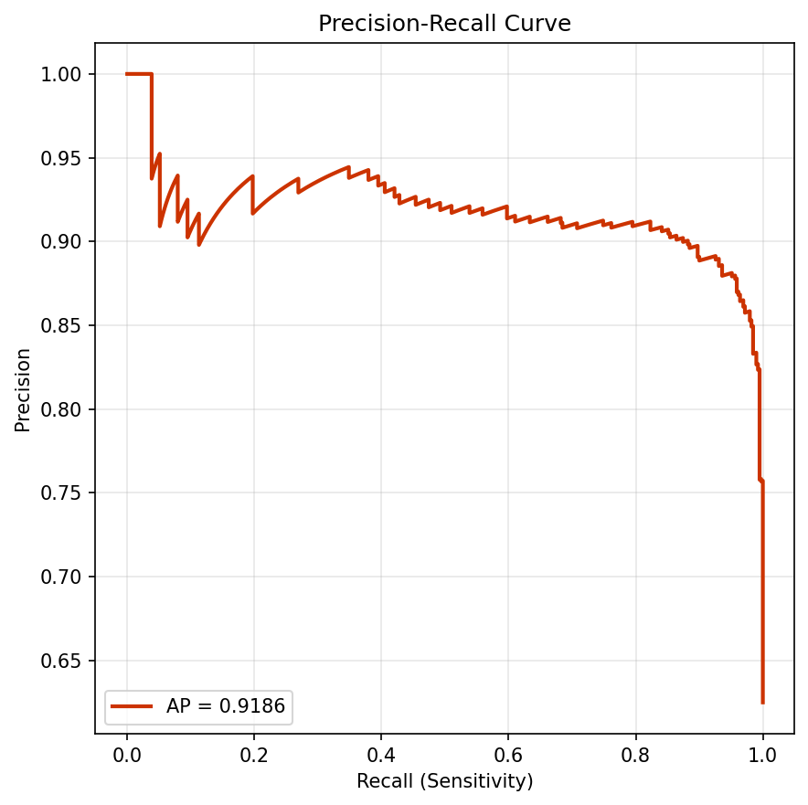
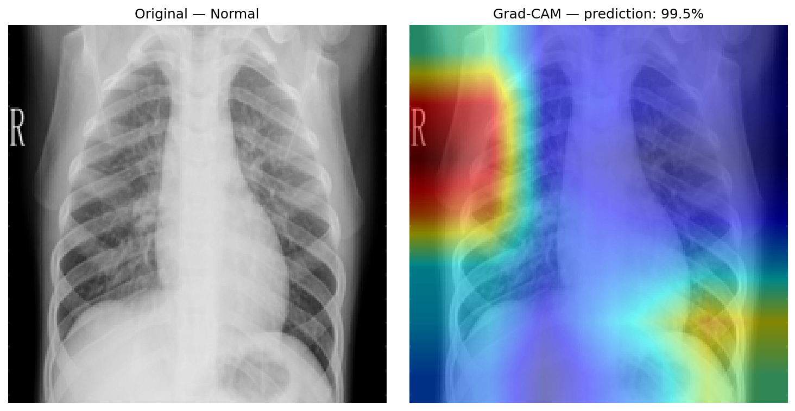
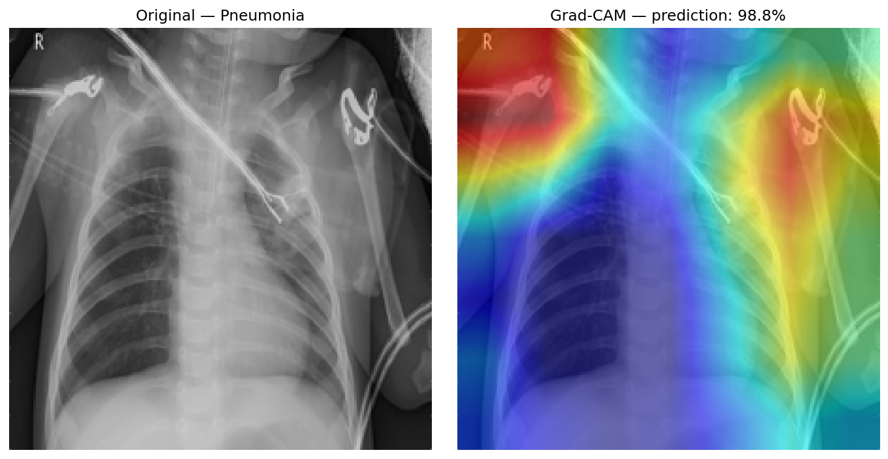

# 🫁 Pneumonia Detection from Chest X-Rays

[](https://medical-ai.x2.dev)
[](LICENSE)
[](https://www.python.org)
[](https://pytorch.org)
[](https://monai.io)

A binary chest X-ray classifier (DenseNet121) that detects radiographic features of pneumonia. Trained on Kaggle's Chest X-Ray Images dataset using Modal Labs GPU.

🌐 **Live demo:** https://medical-ai.x2.dev
📊 **Training run:** [WandB dashboard](https://wandb.ai/aommiez-savel-co-ltd/medical-ai-pneumonia)

---

## ⚠️ Disclaimer

**Educational/research project — not for clinical use.**
- No regulatory clearance (FDA / Thai FDA / CE)
- Performance verified only on held-out Kaggle test set
- Output is decision-support information, not a diagnosis
- A licensed radiologist must interpret all medical images for clinical decisions

---

## 📊 Results

| Metric | Value |
|--------|-------|
| **Test AUROC** | **0.9138** |
| **Test AUPRC** | 0.9186 |
| **F1 (threshold = 0.5)** | 0.8858 |
| **Sensitivity (recall on Pneumonia)** | **99.5%** (388/390) |
| **Specificity (recall on Normal)** | 58.1% (136/234) |
| **Accuracy** | 83.97% |
| Sensitivity @ 95% Specificity | 40.5% |
| Test set size | 624 (390 pneumonia, 234 normal) |

### ROC Curve



### Confusion Matrix



**Interpretation:** The model is biased toward predicting pneumonia (high recall, lower precision on Normal class). This is a deliberate choice via `pos_weight` in the loss function — for a screening tool, missing a true positive is worse than a false alarm. Trade-off can be tuned by adjusting the decision threshold.

### Precision-Recall Curve



---

## 🔥 Grad-CAM Visualization

Shows which regions the model "attended to" when making predictions.

**Normal example:**


**Pneumonia example:**


The heatmap highlights the lung fields in pneumonia cases — suggesting the model has learned anatomically relevant features rather than spurious correlations.

---

## 🏗️ Architecture

```
Input (224×224×3 RGB)
  ↓
DenseNet121 (pretrained ImageNet)
  ↓
Global Average Pool
  ↓
Linear → 1 logit
  ↓
Sigmoid → Pneumonia probability ∈ [0, 1]
```

- **Params:** 6.95M
- **Framework:** PyTorch + MONAI
- **Input preprocessing:** Resize to 224×224, scale intensity to [0, 1]
- **Augmentation (train only):** random horizontal flip, ±10° rotation, intensity jitter

---

## ⚙️ Training Setup

| Setting | Value |
|---------|-------|
| Optimizer | AdamW (lr=1e-4, weight_decay=1e-5) |
| Loss | BCEWithLogitsLoss + `pos_weight` (~0.35 for imbalance) |
| Batch size | 32 |
| Epochs | 10 |
| Schedule | None (loss plateaus quickly) |
| Hardware | Modal Labs T4 GPU |
| Training time | ~5 minutes |
| Cost | < $0.50 (Modal free tier $30/mo covers) |
| Tracking | Weights & Biases |

---

## 📁 Dataset

**Source:** Kaggle [paultimothymooney/chest-xray-pneumonia](https://www.kaggle.com/datasets/paultimothymooney/chest-xray-pneumonia)

| Split | Normal | Pneumonia | Total |
|-------|--------|-----------|-------|
| Train | 1,341 | 3,875 | 5,216 |
| Val | 8 | 8 | 16 |
| Test | 234 | 390 | 624 |

**Limitations:**
- Pediatric population (Guangzhou Women and Children's Medical Center)
- All frontal views (no lateral)
- Small validation set (16 images — unreliable for model selection)
- Labels from one institution — may not generalize globally

See [docs/dataset_card.md](docs/dataset_card.md) for full details.

---

## 🚀 Reproducibility

### Option 1: Train on Modal Labs (recommended — fast, autopilot)

```bash
# 1. Setup
pip install modal kaggle wandb
modal token set --token-id ... --token-secret ...

# 2. Create Modal secrets
modal secret create kaggle-secret KAGGLE_USERNAME=<u> KAGGLE_KEY=<k>
modal secret create wandb-secret WANDB_API_KEY=<k>

# 3. Train (T4 GPU on Modal, ~5 min, ~$0.50)
modal run modal_train.py --epochs 10
```

Checkpoint downloads to `checkpoints/best.pt` automatically.

### Option 2: Train on Google Colab (free GPU)

Open [`notebooks/train_colab.ipynb`](notebooks/train_colab.ipynb) in Colab → Runtime → T4 GPU → Run All.

### Option 3: Train locally (with CUDA GPU)

```bash
git clone https://github.com/aommiez/medical-ai-pneumonia.git
cd medical-ai-pneumonia
pip install -r requirements.txt

# Download dataset
python data/download.py --subset

# Build train/val/test CSVs (run the build-manifests cell from train_colab.ipynb)

# Train
python src/train.py \
    --data-root data/raw/chest_xray \
    --train-csv data/train.csv \
    --val-csv data/val.csv \
    --epochs 10 --batch-size 32 --lr 1e-4 \
    --device cuda \
    --output checkpoints/best.pt
```

### Evaluate

```bash
python src/eval.py \
    --checkpoint checkpoints/best.pt \
    --data-root data/raw/chest_xray \
    --out-dir docs
```

Generates `roc_curve.png`, `pr_curve.png`, `confusion_matrix.png`, `gradcam_*.png`, `metrics.json`.

### Run Web Demo

```bash
python demo/app.py --checkpoint checkpoints/best.pt --port 7860
# → opens http://localhost:7860
```

---

## 📂 Project Structure

```
medical-ai-pneumonia/
├── README.md                 # this file
├── requirements.txt
├── modal_train.py            # Modal training entrypoint
├── data/
│   └── download.py           # Kaggle dataset downloader
├── src/
│   ├── model.py              # MONAI DenseNet121 builder
│   ├── dataset.py            # PyTorch Dataset loader
│   ├── train.py              # CLI training script
│   └── eval.py               # Evaluation + plot generator
├── demo/
│   └── app.py                # Gradio web demo with Grad-CAM
├── notebooks/
│   ├── train_colab.ipynb     # Google Colab notebook
│   └── 02_train_colab.py     # Same content as .py cells
└── docs/
    ├── dataset_card.md       # NIH/Kaggle dataset details
    ├── next_steps.md         # roadmap
    ├── metrics.json          # test metrics
    ├── roc_curve.png
    ├── pr_curve.png
    ├── confusion_matrix.png
    ├── gradcam_normal.png
    └── gradcam_pneumonia.png
```

---

## 🛣️ Roadmap / Stretch Goals

- [x] Baseline DenseNet121 trained — AUROC 0.91
- [x] Live demo deployed via Cloudflare Tunnel
- [x] Grad-CAM visualization
- [ ] Train on full NIH ChestX-ray14 (112k images, 14 diseases)
- [ ] Add lung segmentation (U-Net for ROI localization)
- [ ] Calibration plot + temperature scaling
- [ ] External validation on PadChest / MIMIC-CXR
- [ ] Compare against CheXNet baseline (AUROC 0.768)
- [ ] Bayesian uncertainty via MC Dropout
- [ ] Mobile-friendly demo (ONNX export)
- [ ] Multi-class extension (Bacterial vs Viral pneumonia)

---

## 📚 References

1. Wang X, et al. *ChestX-ray8: Hospital-scale Chest X-ray Database and Benchmarks on Weakly-Supervised Classification and Localization of Common Thorax Diseases.* CVPR 2017.
2. Rajpurkar P, et al. *CheXNet: Radiologist-Level Pneumonia Detection on Chest X-Rays with Deep Learning.* arXiv:1711.05225, 2017.
3. Selvaraju RR, et al. *Grad-CAM: Visual Explanations from Deep Networks via Gradient-based Localization.* ICCV 2017.
4. MONAI Project. *Medical Open Network for AI.* https://monai.io

---

## 📄 License

MIT — see [LICENSE](LICENSE). Kaggle dataset has its own usage terms.

---

## 👤 Author

[@aommiez](https://github.com/aommiez)

Built as part of personal AI portfolio · May 2026
Infrastructure: Hermes Agent + Modal Labs + Cloudflare Tunnel
